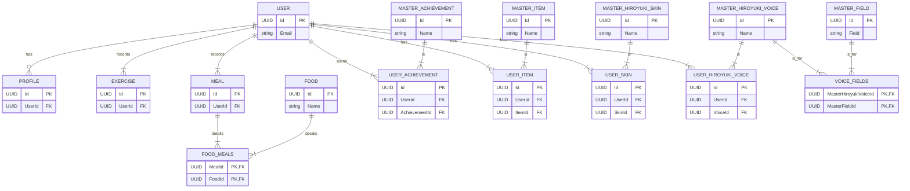

# Hiroyuki Diet API

ひろゆきダイエットの API です。

## 目次

- [Hiroyuki Diet API](#hiroyuki-diet-api)
  - [目次](#目次)
  - [必要要件](#必要要件)
  - [起動方法](#起動方法)
  - [API エンドポイント](#api-エンドポイント)
  - [GraphQL Playground](#graphql-playground)
    - [Playground でのテスト例](#playground-でのテスト例)
      - [1. ユーザー登録 (SignUp)](#1-ユーザー登録-signup)
      - [2. ログイン (Login)](#2-ログイン-login)
      - [3. ユーザー情報の取得 (認証が必要)](#3-ユーザー情報の取得-認証が必要)
  - [GraphQL スキーマ](#graphql-スキーマ)
  - [シーダーの実行方法](#シーダーの実行方法)
  - [データベース構造](#データベース構造)

## 必要要件

- Docker
- Docker Compose

## 起動方法

以下のコマンドを実行すると、API サーバーとデータベースが起動します。

```bash
docker-compose up -d --build
```

- API サーバー: `localhost:8080`
- PostgreSQL: `localhost:5432`

## API エンドポイント

- **GraphQL API**: `http://localhost:8080/query`
- **GraphQL Playground**: `http://localhost:8080/`

## GraphQL Playground

`http://localhost:8080/` にアクセスすると、GraphQL Playground が利用できます。
Playground 上で直接クエリやミューテーションを実行し、API の動作を確認できます。

### Playground でのテスト例

#### 1. ユーザー登録 (SignUp)

```graphql
mutation {
  signUp(input: { email: "test@example.com", password: "password123" }) {
    userId
    token
  }
}
```

#### 2. ログイン (Login)

```graphql
mutation {
  login(input: { email: "test@example.com", password: "password123" }) {
    userId
    token
  }
}
```

#### 3. ユーザー情報の取得 (認証が必要)

ログイン後に取得した`token`を、HTTP ヘッダーに設定して実行します。

**HTTP HEADERS**

```json
{
  "Authorization": "Bearer YOUR_JWT_TOKEN"
}
```

**Query**

```graphql
query {
  user(id: "YOUR_USER_ID") {
    id
    email
    level
    profile {
      userName
      age
    }
  }
}
```

## GraphQL スキーマ

<details>
<summary>schema.graphqlsを見る</summary>

```graphql
# GraphQL schema example
#
# https://gqlgen.com/getting-started/
directive @auth on FIELD_DEFINITION

enum FieldEnum {
  login
  signin
  home
  meal
  meal_form
  meal_edit
  data
  profile
  profile_edit
  exercise
  eexercise_complete
  achievement
  achievement_complete
  chibi_hiroyuki
}
enum SkinPartEnum {
  head
  face
  body
}

enum MealTypeEnum {
  breakfast
  lunch
  dinner
  snacking
}

enum GenderEnum {
  man
  woman
}
type Query {
  user(id: ID!): User! @auth
  foods: [Food!]! @auth
}

type Mutation {
  signUp(input: Auth!): JWTTokenResponse
  tokenAuth(input: InputTokenAuth!): JWTTokenResponse! @auth
  login(input: Auth!): JWTTokenResponse!
  logout(input: ID!): ID @auth
  createExercise(input: InputExercise!): ID @auth
  editExercise(input: InputExercise!): ID @auth
  receiptAchievement(input: InputAchievement!): ID @auth
  createProfile(input: InputProfile!): ID @auth
  editProfile(input: InputProfile!): ID @auth
  createMeal(input: InputMeal!): ID @auth
  editMeal(input: InputMeal!): ID @auth
  deleteMeal(input: ID!): ID @auth
  postSkin(input: InputPostSkin!): ID @auth
  useItem(input: InputUseItem!): ID @auth
}
input InputUseItem {
  userId: ID!
  itemId: ID!
  count: Int!
}

input InputTokenAuth {
  userId: ID!
  token: Int!
}

input InputPostSkin {
  userId: ID!
  skinId: ID!
}

input InputAchievement {
  userId: ID!
  achievementId: ID!
}

input Auth {
  email: String!
  password: String!
}
input InputExercise {
  userId: ID
  time: Int!
}
input InputProfile {
  userId: ID!
  userName: String!
  age: Int!
  gender: String!
  weight: Int!
  height: Int!
  targetWeight: Int!
  targetDailyExerciseTime: Int!
  targetDailyCarorie: Int!
}
input InputMeal {
  userId: ID
  mealId: ID
  mealType: MealTypeEnum!
  foods: [ID!]!
}

type User {
  id: ID!
  email: String!
  profile: Profile!
  level: Int!
  signUpToken: SignUpToken!
  isTokenAuthenticated: Boolean!
  experiencePoInt: Int!
  exercisies(offset: String!, limit: String!): [Exercise!]
  meals: [Meal!]
  meal(id: ID!): Meal!
  items: [ItemResponse!]
  hiroyukiSkins(usingSkin: Boolean!): [SkinResponse!]!
  achievements: [AchievementResponse!]!
  hiroyukiVoicies(fields: [FieldEnum!]!): [HiroyukiVoiceResponse!]!
}

type HiroyukiVoiceResponse {
  id: ID!
  name: String!
  voiceUrl: String!
  releaseLevel: Int!
  fields: [FieldEnum!]!
  isHaving: Boolean!
}
type AchievementResponse {
  id: ID!
  name: String!
  isClear: Boolean!
}

type SkinResponse {
  id: ID!
  name: String!
  description: String!
  part: SkinPartEnum!
  skinImage: String!
  releaseLevel: Int!
  isUsing: Boolean!
  isHaving: Boolean!
}

type ItemResponse {
  id: ID!
  name: String!
  description: String!
  itemImage: String!
  count: Int!
}

type Meal {
  id: ID!
  mealType: MealTypeEnum!
  totalCalorie: Int!
  foods: [Food!]!
}

type SignUpToken {
  id: ID!
  token: Int!
  surviveTime: Int!
}

type Exercise {
  id: ID!
  time: Int!
  date: String!
}

type Profile {
  id: ID!
  userName: String!
  age: Int!
  gender: GenderEnum!
  weight: Int!
  height: Int!
  targetWeight: Int!
  targetDailyExerciseTime: Int!
  targetDailyCarorie: Int!
  isCreated: Boolean!
  favorability: Int
}

type Food {
  id: ID!
  name: String!
  estimateCalorie: Int!
  lastUsedDate: String!
}

type JWTTokenResponse {
  userId: ID!
  token: String!
}
```

</details>

## シーダーの実行方法

マスターデータをデータベースに投入するためのシーダーが用意されています。
`FirstCreate`メソッドが各モデルに実装されており、アプリケーションの起動時に自動で実行されます。

もし手動でシーダーを実行したい場合は、以下の手順で行います。

1.  実行中の`backend`コンテナに入る

    ```sh
    docker exec -it hiroyuki_diet_app sh
    ```

2.  `seeder`ディレクトリに移動する

    ```bash
    cd seeder
    ```

3.  シーダープログラムを実行する
    ```bash
    go run main.go
    ```

## データベース構造

このプロジェクトでは PostgreSQL を使用しています。
GORM によって、モデル定義に基づいたテーブルが自動的に作成されます。主要なテーブル間の関連は以下の通りです。

<details>
<summary>ER図を見る</summary>



</details>
